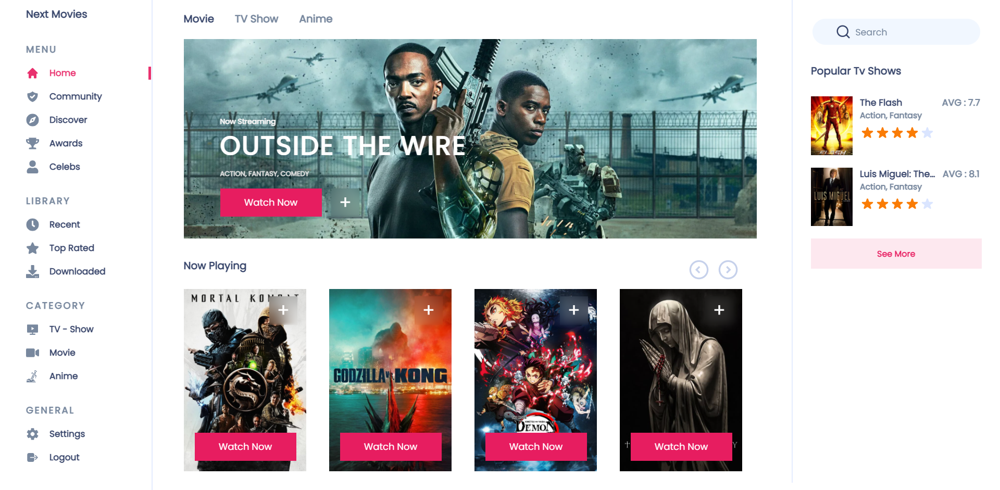

 <h1>Next Movies 🎞 </h1>

## Veja a versão na Web!
- [Next Movies](https://next-movies-pi.vercel.app/)

## 🚀 Tecnologias

Esse projeto foi desenvolvido com as seguintes tecnologias:

- [React](https://reactjs.org)
- [TypeScript](https://www.typescriptlang.org/)
- [Next.js](https://nextjs.org/)
- [TMDB api](https://developers.themoviedb.org/3)
- [Styled Components](https://styled-components.com/)
- [Jikan api](https://jikan.docs.apiary.io/#introduction/information)

## 💻 Projeto

Next Movies é um projeto feito inspirado em serviços de streaming. Nele é possível
ver filmes, séries e animes do momento, em um layout simples mas muito agradável.

## 🔖 Layout
Este layout foi inspirado em um projeto do dribble.

- [Layout](https://dribbble.com/shots/15109777-Movie-Streaming-Dashboard/attachments/6843253?mode=media)

<strong> Em breve Dark mode! </strong>

## 📁 Scripts

Para rodar a aplicação web utilize:
- yarn dev
